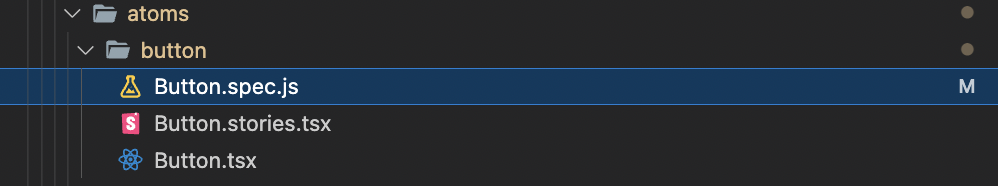

# E Learing Tool Platform

## Database

- [MongoDB Schema](https://drive.google.com/file/d/1VZ2wwj-naBXLzNkfr2y3YkJFe9ENFtDE/view?usp=sharing)

## Useful links

- #### Tools
  - [Text Editor](https://mantine.dev/others/rte/)
- #### Learn more about the power of

  - [Pipelines](https://turborepo.org/docs/core-concepts/pipelines)
  - [Caching](https://turborepo.org/docs/core-concepts/caching)
  - [Remote Caching](https://turborepo.org/docs/core-concepts/remote-caching)
  - [Scoped Tasks](https://turborepo.org/docs/core-concepts/scopes)
  - [Configuration Options](https://turborepo.org/docs/reference/configuration)
  - [CLI Usage](https://turborepo.org/docs/reference/command-line-reference)

- #### Learning more about tailwind CSS

  - [Taiwind Component](https://tailwind-elements.com/docs/standard/components/)
  - [Tailwind Document](https://tailwindui.com/documentation)
  - [How to Setup Next.js + TypeScript + Eslint + Storybook + Jest + Enzyme](https://javascript.plainenglish.io/how-to-setup-next-js-typescript-eslint-storybook-jest-enzyme-610451591df0)
  - [Storybook](https://storybook.js.org/)
  - [Jest](https://jestjs.io/)
  - [Jest Cheatsheet](https://github.com/sapegin/jest-cheat-sheet)
  - [Enzyme Cheatsheet](https://gist.github.com/jahe/9bf2cb1f849b7ed96c6ce20ede7f66a2)
  - [postman collection](http://www.postmanlabs.com/postman-collection/)
  - [s3 document nodejs](https://aws.plainenglish.io/aws-s3-implementation-using-node-js-f5f5fcacc84b)

## Setup project & Project Structure

### Create tubo repo project

- Clone project with this [URL](https://sabaiCode@bitbucket.org/sabaiCode/tuborepo.git)
- yarn install ( Install all project's packages used)

### RUN the project

- Run all apps

```sh
  yarn dev
```

- Run specific app
  Goto specific root of the project
  ```sh
  cd pathOfRootProject
  yarn dev
  ```
- Install package [How to install package to workspace](https://turborepo.org/docs/handbook/package-installation)

### Project structure

- apps folder, it consists all apps in your project
- node_modules folder, it consists all packages that you have installed
- For more detail [Tuborepo](https://turborepo.org/docs/getting-started)
  #### Packages/ui , it is shared component in hold project.
  - Create a component , You need to create storybook and Unit test, look like this
    

### Utilities

This turborepo has some additional tools already setup for you:

- [TypeScript](https://www.typescriptlang.org/) for static type checking
- [ESLint](https://eslint.org/) for code linting
- [Prettier](https://prettier.io) for code formatting

### Remote Caching

Turborepo can use a technique known as [Remote Caching](https://turborepo.org/docs/core-concepts/remote-caching) to share cache artifacts across machines, enabling you to share build caches with your team and CI/CD pipelines.

By default, Turborepo will cache locally. To enable Remote Caching you will need an account with Vercel. If you don't have an account you can [create one](https://vercel.com/signup), then enter the following commands:

```sh
npx turbo login
```

This will authenticate the Turborepo CLI with your [Vercel account](https://vercel.com/docs/concepts/personal-accounts/overview).

Next, you can link your Turborepo to your Remote Cache by running the following command from the root of your turborepo:

```sh
npx turbo link
```

### List ports are running and kill [link](https://stackoverflow.com/questions/4421633/who-is-listening-on-a-given-tcp-port-on-mac-os-x)

## Git WORKFLOW

#### Develop branches


#### Feature branches


#### Hotfix branches


## Branch Naming

```sh
git checkout -b feature/some-branch-name
git checkout -b release/some-branch-name
git checkout -b hotfix/some-branch-name
```

## Commit Message

```sh
git commit -m "`ticket_number` + massage"
```
